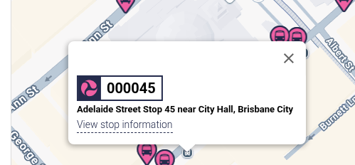

# When's My Next Bus

This project hooks into the Brisbane City Council's translink APIs to retrieve the next bus times for certain stops. 

**You can add your own**. To find stops, search for them here: https://jp.translink.com.au/plan-your-journey/stops. But note, it's not the stop name, but the id of the stop which is a 6-digit number::

---

There are 2 interfaces:
 - Alexa Skill - See `index.js`
 - Webpage - See `webpage.js`

## Alexa Skill

Skill that accesses the translink API to give the next estimated bus time. 

Currently, only the phrase 'Alexa, when's my next bus?' works for the 375 bus at the woolworths paddington stop.

**TO DO**
Add a variable so it can check the next time for a certain bus, for example:
> 'Alexa, when's the next 377'
> 
> -> "The next 377 bus is in 5mins"

> 'Alexa, when's the next 375'
>
> -> "The next 375 bus is in 3mins"

(default)
> 'Alexa, when's my next bus'
>
> -> "The next 377 is in 7mins"

## Webpage
AWS Lambda function that sends an html page with bus times for specific stops. Currently hard coded to 2 morning stops and 1 afternoon stop

**TO DO**
- Have a selection process so people can add their own stops, and have it persistent on their device
- Add tests
- auto deploy (via github)
